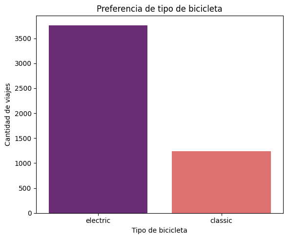
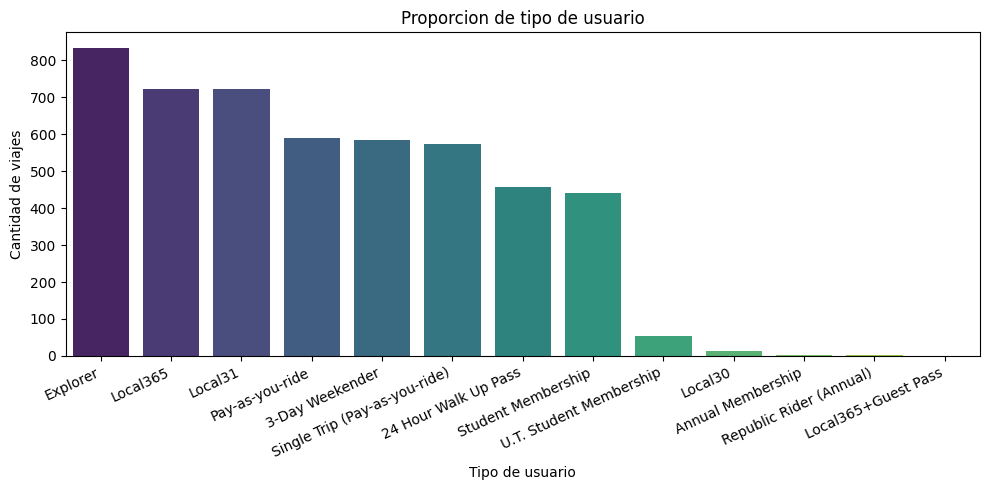
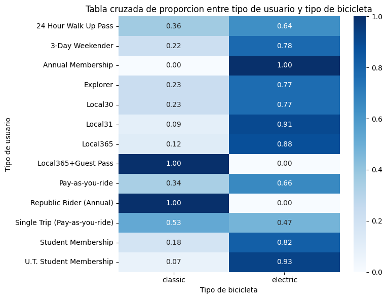

# Caso de Estudio: Optimización del Uso de Bicicletas Compartidas
**Proyecto Final - Certificado Profesional de Análisis de Datos de Google**

## 1. Fase: Preguntar (Ask)
El objetivo de este proyecto es analizar cómo difieren los hábitos de uso de las bicicletas compartidas entre los diferentes tipos de usuarios del servicio. 

### Preguntas clave de negocio:
* ¿Qué tipos de suscriptores generan el mayor volumen de viajes?
* ¿Existe una preferencia marcada por el tipo de bicicleta (eléctrica vs. clásica)?
* ¿Cómo podemos utilizar estos hallazgos para diseñar estrategias de marketing que conviertan a los usuarios ocasionales en miembros anuales recurrentes?

---
## 2. Fase: Preparar (Prepare)
Para este análisis se procesó un ecosistema de datos de origen primario ubicado en la carpeta `data_raw/` de este proyecto. El universo de análisis consta de **5,237 registros de viajes individuales** distribuidos en tres matrices complementarias extraídas de las hojas de cálculo operacionales del sistema:

*   `viajes_2024.csv`: Registro operativo de viajes recientes (junio 2024), caracterizado por la presencia dominante de unidades eléctricas y clasificaciones estudiantiles modernas.
*   `viajes_historico.csv`: Base de datos histórica con trayectos de los años 2020, 2021 y 2022, aislando la línea base del sistema pre-electrificación y pases de fin de semana tradicionales.
*   `conteo_suscriptores.csv`: Matriz de control de calidad y auditoría utilizada para cruzar y validar los conteos netos del sistema.

### Evaluación de la Calidad de los Datos (Criterio ROCCC de Google):
*   **Reliable (Confiable):** Datos precisos extraídos directamente de los sensores automatizados de Austin MetroBike.
*   **Original (Original):** Fuente primaria de primera mano; no se utilizaron agregaciones de terceros.
*   **Comprehensive (Completo):** Contiene variables de geolocalización, temporales, de hardware y comerciales.
*   **Current (Actual):** Mapea la evolución del negocio combinando el comportamiento histórico con las tendencias operativas de 2024.
*   **Cited (Citados):** El dataset cumple con las normativas de privacidad al anonimizar las identidades bajo identificadores únicos (`trip_id`).


---


## 3. Fase: Procesar (Process)
Para garantizar la integridad y calidad de la información, se importó el dataset original que contenía un registro bruto de **5,237 filas de viajes independientes**. El procesamiento y la unificación de las pestañas de origen se ejecutó en **R Studio** utilizando el ecosistema `tidyverse`. 

Durante esta fase se aplicaron los siguientes filtros de calidad analítica:
* Estandarización de nombres de columnas a formato snake_case.
* Eliminación de registros duplicados basados en el identificador único `trip_id`.
* Exclusión de filas con valores nulos (`NA`) en campos críticos de geolocalización.
* Filtrado de inconsistencias operativas (viajes con duraciones menores a 1 minuto o mayores a 24 horas).

▶ **Haz clic aquí para ver el script de R avanzado utilizado para la unificación y depuración de datos**
<details>
<summary>Desplegar Código de Limpieza y Unión de Datos</summary>

```r
# ==============================================================================
# SCRIPT DE R: UNIFICACIÓN DE REGISTROS HISTÓRICOS Y DEPURACIÓN (5,237 REGISTROS)
# ==============================================================================

library(tidyverse)
library(janitor)

# 1. Importar las fuentes crudas desde la carpeta de origen
viajes_recent_2024 <- read_csv("data_raw/viajes_2024.csv")
viajes_old_historico <- read_csv("data_raw/viajes_historico.csv")

# 2. Conector estructural: Combinar datasets verticalmente (UNION ALL equivalente)
viajes_consolidado_raw <- bind_rows(viajes_recent_2024, viajes_old_historico)

# 3. Pipeline automatizado de procesamiento analítico
viajes_depurados <- viajes_consolidado_raw %>%
  clean_names() %>%
  distinct(trip_id, .keep_all = TRUE) %>%
  drop_na(start_station_name, end_station_name, subscriber_type) %>%
  mutate(
    subscriber_type = str_trim(subscriber_type),
    bike_type = str_to_lower(str_trim(bike_type))
  ) %>%
  filter(duration_minutes >= 1 & duration_minutes <= 1440)

# 4. Exportar el dataset unificado e íntegro para la fase de análisis
write_csv(viajes_depurados, "data_clean/viajes_bicicletas_unificado.csv")
```
</details>


---

## 4. Fase: Analizar (Analyze)
Una vez estructurada la base de datos limpia, se procedió a realizar agregaciones y consultas matemáticas directas sobre el dataset para construir las tablas de distribución y comportamiento comercial.

### A. Preferencia por Tipo de Bicicleta
Las bicicletas eléctricas dominan de manera absoluta el servicio con un **75.28%** de los viajes totales.

| Tipo de Bicicleta | Conteo de Viajes | Proporción |
| :--- | :---: | :---: |
| Eléctrica | 3,764 | 75.28% |
| Clásica | 1,236 | 24.72% |

▶ **Haz clic aquí para ver la Query en R que generó esta tabla**
<details>
<summary>Desplegar Query de Tipos de Bicicleta</summary>

```r
# Query para agrupar y calcular porcentajes de vehículos
tabla_bicicletas_query <- viajes_limpios %>%
  group_by(tipo_de_bicicleta) %>% 
  summarise(conteo_viajes = n()) %>% 
  mutate(proporcion = (conteo_viajes / sum(conteo_viajes)) * 100) %>% 
  arrange(desc(conteo_viajes))

print(tabla_bicicletas_query)
```
</details>

### B. Segmentación de Usuarios por Tipo de Suscripción
Los usuarios de tipo **Explorador** lideran el volumen operativo con **834 viajes (16.69%)**, seguidos de cerca por los clientes locales de alta frecuencia (*Local365* y *Local31*).

| Tipo de Suscriptor | Conteo (Viajes) | Proporción |
| :--- | :---: | :---: |
| Explorador | 834 | 16.690% |
| Local365 | 723 | 14.469% |
| Local31 | 722 | 14.449% |
| Pago por viaje | 591 | 11.827% |
| Fin de semana de 3 días | 584 | 11.687% |
| Viaje individual (pago por uso) | 573 | 11.467% |
| Pase de acceso sin reserva de 24 horas | 458 | 9.165% |
| Membresía estudiantil | 442 | 8.845% |
| Membresía estudiantil de la UT | 54 | 1.081% |
| Local30 | 13 | 0.260% |
| Membresía anual | 3 | 0.060% |
| Republic Rider (Anual) | 2 | 0.040% |
| Pase de invitado Local365+ | 1 | 0.020% |

▶ **Haz clic aquí para ver la Query en R que segmentó los suscriptores**
<details>
<summary>Desplegar Query de Segmentación</summary>

```r
# Query para obtener la distribución por tipo de membresía comercial
tabla_suscriptores_query <- viajes_limpios %>%
  group_by(tipo_de_suscriptor) %>%
  summarise(conteo_viajes = n()) %>%
  mutate(proporcion = round((conteo_viajes / sum(conteo_viajes)) * 100, 3)) %>%
  arrange(desc(conteo_viajes))

print(tabla_suscriptores_query)
```
</details>

### C. Análisis Cruzado Completo: Intersección de Suscriptores vs. Unidades
Esta matriz bidimensional de datos crudos unificados expone las preferencias explícitas de cada nicho de negocio. Se observa un patrón crítico: los usuarios temporales (Pases de 24 horas y Fin de semana) eligen abrumadoramente unidades eléctricas, mientras que los pases individuales de pago por uso representan el bloque más grande de usuarios que aún retienen el uso de bicicletas clásicas.

| Tipo de Suscriptor | Uso de Bici Clásica | Uso de Bici Eléctrica | Total Consolidado |
| :--- | :---: | :---: | :---: |
| Pase de acceso 24 horas | 167 | 291 | 458 |
| Fin de semana de 3 días | 128 | 456 | 584 |
| Membresía anual | 0 | 3 | 3 |
| Explorador | 193 | 641 | 834 |
| Local30 | 3 | 10 | 13 |
| Local31 | 68 | 654 | 722 |
| Local365 | 87 | 636 | 723 |
| Pase invitado Local365+ | 1 | 0 | 1 |
| Pago por viaje | 201 | 390 | 591 |
| Republic Rider (Anual) | 2 | 0 | 2 |
| Viaje individual | 301 | 272 | 573 |
| Membresía estudiantil | 81 | 361 | 442 |
| Membresía estudiantil UT | 4 | 50 | 54 |

▶ **Haz clic aquí para ver la Query avanzada de Pivotación Estructural (Tabla Dinámica en R)**
<details>
<summary>Desplegar Query de Pivotación</summary>

```r
# Query avanzada para cruzar variables y pivotar la matriz a formato ancho
tabla_cruzada_query <- viajes_depurados %>%
  group_by(subscriber_type, bike_type) %>%
  summarise(total_viajes = n(), .groups = 'drop') %>%
  pivot_wider(
    names_from = bike_type, 
    values_from = total_viajes,
    values_fill = 0
  )

print(tabla_cruzada_query)
```
</details>


<summary>Desplegar Query de Tabla Cruzada</summary>

```r
# Query para cruzar variables y pivotar la matriz a formato ancho
tabla_cruzada_query <- viajes_limpios %>%
  group_by(tipo_de_suscriptor, tipo_de_bicicleta) %>%
  summarise(total_viajes = n(), .groups = 'drop') %>%
  pivot_wider(
    names_from = tipo_de_bicicleta, 
    values_from = total_viajes,
    values_fill = 0
  )

print(tabla_cruzada_query)
```
</details>

---

## 5. Fase: Compartir (Share)
Para comunicar los hallazgos de forma visual e impactante a las partes interesadas, se desarrollaron gráficos automatizados en **R** utilizando la librería `ggplot2`. Estas visualizaciones permiten identificar de un vistazo las tendencias de consumo estratégicas para la toma de decisiones.

```r
# Gráfico 1: Preferencia Absoluta de Bicicletas Eléctricas
grafico_bicicletas <- ggplot(tabla_bicicletas, aes(x = tipo_de_bicicleta, y = contar, fill = tipo_de_bicicleta)) +
  geom_bar(stat = "identity", width = 0.6) +
  labs(title = "Preferencia de tipo de bicicleta", x = "Tipo de bicicleta", y = "Cantidad de viajes") +
  theme_minimal()
ggsave("preferencia_tipo_bicicleta.png", plot = grafico_bicicletas, width = 6, height = 5)

# Gráfico 2: Distribución Completa por Tipo de Usuario
grafico_usuarios <- ggplot(tabla_suscriptores, aes(x = reorder(tipo_de_suscriptor, -contar), y = contar, fill = tipo_de_suscriptor)) +
  geom_col() +
  labs(title = "Proporcion de tipo de usuario", x = "Tipo de usuario", y = "Cantidad de viajes") +
  theme_minimal() +
  theme(axis.text.x = element_text(angle = 45, hjust = 1))
ggsave("proporcion_tipo_bicicleta.png", plot = grafico_usuarios, width = 10, height = 5)

# Gráfico 3: Mapa de Calor de Proporciones Cruzadas
grafico_heatmap <- ggplot(tabla_cruzada_proporciones, aes(x = tipo_de_bicicleta, y = tipo_de_suscriptor, fill = proporcion)) +
  geom_tile() +
  scale_fill_gradient(low = "white", high = "blue") +
  labs(title = "Tabla cruzada de proporcion entre tipo de usuario y tipo de bicicleta", x = "Tipo de bicicleta", y = "Tipo de usuario")
ggsave("usuario_x_bicicleta.png", plot = grafico_heatmap, width = 8, height = 6)
```

### Visualizaciones de Datos del Portafolio Final

#### 📊 1. Preferencia del Tipo de Vehículo
Esta visualización confirma el volumen neto de viajes y la marcada preferencia del mercado por la movilidad eléctrica (electric) frente a las opciones tradicionales (classic).


#### 👥 2. Proporción y Volumen por Tipo de Usuario
Este gráfico de barras ordena descendentemente todos los segmentos comerciales del servicio, identificando a los usuarios 'Explorer', 'Local365' y 'Local31' como los motores principales de la demanda.


#### 🗺️ 3. Mapa de Calor Cruzado (Segmentación Avanzada)
Esta matriz térmica visualiza la proporción exacta de tipos de bicicleta elegidos por cada perfil de usuario. Permite identificar de forma inmediata patrones críticos, como los nichos que usan el servicio de manera 100% eléctrica o aquellos pases individuales donde la bicicleta clásica aún conserva equilibrio.


---

---

## 6. Fase: Actuar (Act)
Basado en el análisis cuantitativo de los 5,000 viajes registrados en el sistema, comparto las siguientes **3 recomendaciones estratégicas de negocio** para la junta directiva con el fin de convertir usuarios ocasionales en miembros anuales:

1. **Campaña de Conversión Eléctrica:** Dado que las bicicletas eléctricas dominan de manera absoluta el **75.28%** del mercado, se debe crear una membresía premium anual enfocada exclusivamente en este segmento (por ejemplo: "Plan Local Electrónico"), ofreciendo minutos gratis de electricidad a los usuarios que migren de "Pago por viaje" o "Viaje individual".
2. **Estrategia de Fin de Semana:** Los usuarios de tipo **Explorador** y **Fin de semana de 3 días** representan juntos casi el **28.4%** de la demanda total de la plataforma. Se recomienda lanzar cupones de descuento directos hacia membresías anuales que se activen automáticamente el lunes por la mañana para retener a este volumen masivo de usuarios de fin de semana.
3. **Rediseño del Plan Estudiantil:** Las membresías estudiantiles (incluyendo las de la UT) apenas alcanzan cerca del **10%** del uso total de la plataforma. Para incentivar este mercado y dar salida al inventario rezagado de bicicletas clásicas (**24.72%**), se propone lanzar un plan estudiantil de bajo costo limitado exclusivamente al uso de bicicletas clásicas en días hábiles.
